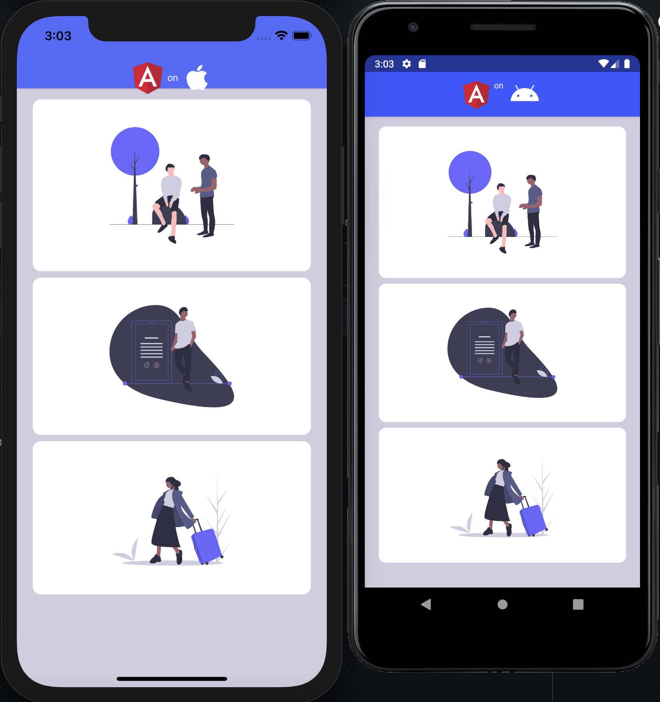

# Directive Touch Animation App

</img> Adding [Animations using Angular Attibute Directives](https://nativescripting.com/posts/animations-using-angular-directives) by [William TjondroSuharto](https://twitter.com/williamjuan27)

[</img>](https://play.nativescript.org/?template=play-ng&id=Wh9rvG&v=49)

Example taken from [:bookmark:`nativescripting.com`](https://nativescripting.com/posts/animations-using-angular-directives) by [William TjondroSuharto](https://twitter.com/williamjuan27) and can be used as a template since it has already been converted to [NativeScript 7](https://nativescript.org/blog/nativescript-7-announcement)

## :o: Create a project by using this template

```
ns create nsDirectiveTouchAnimationApp --template https://github.com/CraveFM/nsDirectiveTouchAnimationApp
```

## :bookmark: Create a project from Scratch

```
ns create nsDirectiveTouchAnimationApp --template @nativescript/template-blank-ng
```

:gear: Reverse Engineering from [William TjondroSuharto](https://twitter.com/williamjuan27)'s Example

- [ ] Create a `NSPlayground` directory 

- [ ] Download the old {N} 6.0 project from [Playground](https://play.nativescript.org/?template=play-ng&id=sxs0F7&v=7)

- [ ] Move the `NSPlayground.zip` file to the `NSPlayground` directory in the project

```
unzip ~/Downloads/NSPlayground.zip -d NSPlayground
```

- [ ] Assets

* copy `assets` folder to the `src` directory

```
cp -r NSPlayground/app/assets src
```

:round_pushpin: Angular CLI schematics generation tools

```
npm install @schematics/angular @nativescript/schematics tslint --save-dev 
```

- [ ] Create the `angular.json` file

```json
cat <<EOF > angular.json
{
  "$schema": "./node_modules/@angular/cli/lib/config/schema.json",
  "version": 1,
  "newProjectRoot": "projects",
  "cli": {
    "defaultCollection": "@nativescript/schematics"
  },
  "projects": {
    "project-name": {
      "root": "",
      "sourceRoot": "src",
      "projectType": "application",
      "prefix": "app",
      "schematics": {
        "@schematics/angular:component": {
          "style": "scss"
        }
      }
    }
  },
  "defaultProject": "project-name"
}
EOF
```

### :a: TouchScaleAnimation Attribute Directive

### :m: The directives

https://dzone.com/articles/what-are-hostbinding-and-hostlistener-in-angular

The basic difference between a component and a directive is that a component has a template, whereas an attribute or structural directive does not have a template.

- [ ] Generate the directive

```
ng generate directive directives/TouchScaleAnimation --skip-tests=true
```

#### :construction: Visibility Issue!

This will add the `TouchScaleAnimationDirective` class to the `App` Module Class, 

```typescript
@NgModule({
  bootstrap: [AppComponent],
  imports: [NativeScriptModule, AppRoutingModule],
  declarations: [AppComponent, TouchScaleAnimationDirective],
  schemas: [NO_ERRORS_SCHEMA],
})
...
```

it needs to be moved to the `Home` Module Class

```typescript
@NgModule({
  imports: [NativeScriptCommonModule, HomeRoutingModule],
  declarations: [HomeComponent, TouchScaleAnimationDirective],
  schemas: [NO_ERRORS_SCHEMA],
})
...
```

:round_pushpin: in the `TouchScaleAnimationDirective` `Class`

- [ ] Add the instance variables that will be used later on

```typescript
  private view: View;
  private duration: number; 
  private currentAnimation;
```

- [ ] Edit the constructor

```typescript
  constructor(el: ElementRef) {
    this.view = el.nativeElement;
    this.duration = 0;
  }
```

- [ ] implement the private methods that will be used later on


```typescript
  private animatePressed(): void {
    let view: View = this.view;
    if (this.currentAnimation) {
      this.currentAnimation.cancel();
    }
    this.currentAnimation = view.animate({ opacity: 0, duration: this.duration })
      .then(() => view.animate({ scale: { x: 0.98, y: 0.98 }, duration: this.duration }))
      .then(() => view.animate({ opacity: 0.8, duration: this.duration }))
      .then(() => view.animate({ curve: AnimationCurve.easeIn, duration: this.duration } ))
      .catch((e) => { console.log(e.message); } );
  }

  private animateReleased(): void {
    let view: View = this.view;
    if (this.currentAnimation) {
      this.currentAnimation.cancel();
    }
    this.currentAnimation = view.animate({ opacity: 0, duration: this.duration })
      .then(() => view.animate({ scale: { x: 1, y: 1 }, duration: this.duration }))
      .then(() => view.animate({ opacity: 1, duration: this.duration }))
      .then(() => view.animate({ curve: AnimationCurve.easeIn, duration: this.duration } ))
      .catch((e) => { console.log(e.message); } );
  }
```

- [ ] implement the `@HostListener` `Decorator` and add its method

```typescript
  @HostListener('touch', ['$event'])
  onTouch(args: TouchGestureEventData): void {
    console.log('action: ' + args.action);
    if (args.action === 'down') {
        this.animatePressed();
    } else if (args.action === 'up') {
        this.animateReleased();
    }
  }
```

### :m: Home Component

:round_pushpin: Styles

- [ ] Add the `styleUrls` operator to the `@Component` decorator

```typescript
@Component({
    selector: "Home",
    templateUrl: "./home.component.html",
    styleUrls: ["./home.component.css"]
})
```

- [ ] Let's add a new `home.component.css` stylesheet and add the following stylesheet classes

```scss
.container {
    font-size: 20;
    background-color: #D0CCE0;
    padding: 10 0;
}

.cards {
    margin: 4 20;
    background-color: #fff;
    padding: 20;
    border-radius: 10;
}
```


:round_pushpin: Template

- [ ] Let's finish with the XML template

* In the current `<GridLayout>` replace the comment `<!-- Add your page content here -->` with


```xml
    <ScrollView>
        <StackLayout class="container">
            <StackLayout [nsTouchScaleAnimation] class="cards"
                (tap)="onCardTap(1)">
                <Image src="~/assets/img1.png" width="200"
                    stretch="aspectFit"></Image>
            </StackLayout>

            <StackLayout [nsTouchScaleAnimation] class="cards"
                (tap)="onCardTap(2)">
                <Image src="~/assets/img2.png" width="200"
                    stretch="aspectFit"></Image>
            </StackLayout>

            <StackLayout [nsTouchScaleAnimation] class="cards"
                (tap)="onCardTap(3)">
                <Image src="~/assets/img3.png" width="200"
                    stretch="aspectFit"></Image>
            </StackLayout>
        </StackLayout>
    </ScrollView>
```

:round_pushpin: `HomeComponent` Class

- [ ] in the HomeComponent `Class`, add the method associated with the gestures

```typescript
    onCardTap(index: number): void {
        console.log('card tap', index);
    }
```

## :b: ActionBar Structural Directive

We will follow the {N} [Ng Directives](https://docs.nativescript.org/angular/ui/ng-components/ng-directives) example and change the `ActionBar` of the `HomeComponent` template


:round_pushpin: Structural Directives

- [ ] Generate the directives for `Android` and `iOS`

```
ng generate directive directives/ifAndroid --skip-tests=true
```

```
ng generate directive directives/ifIos --skip-tests=true
```

:construction: Follow the same directives for fixing the [Visibility Issue](README.md#construction-visibility-issue) when running the directives under a specific module.

- [ ] Change the constructors

change the constructors from :

```typescript
  constructor() { }
```

to : 

```typescript
  constructor(private container: ViewContainerRef, private templateRef: TemplateRef<View>) { }
```

- [ ] Implements the 'OnInit' lifecycle along with its `ngOnInit()` method

```typescript
....     implements OnInit {

  ngOnInit() {
    if (isAndroid) {
      this.container.createEmbeddedView(this.templateRef);
    }
  }
```


:bulb: change the platform accordingly for testing `iOS` it's `isIOS` and `Android` it's `isAndroid`


:gear: `Fonts` settings

To demonstrate the platform segragation, using `Font Awesome` Fonts to display the respective platform icon will be useful


- [ ] `Font Awesome` 5.15.1 Fonts

* Download the [fontawesome-free-5.15.1-web.zip](https://github.com/FortAwesome/Font-Awesome/releases/download/5.15.1/fontawesome-free-5.15.1-web.zip) file from github 

* unzip the file which should be installed in the `~/Downloads` directory

```
unzip ~/Downloads/fontawesome-free-5.15.1-web.zip
```

* create the `fonts` directory

```
mkdir src/fonts
```

* install the `fonts` files

```
cp fontawesome-free-5.15.1-web/webfonts/*.ttf src/fonts
```

* clean up the zip file

```
rm -rf fontawesome-free-5.15.1-web
```

- [ ] `Font Awesome` [Settings](https://docs.nativescript.org/ui/components/icon-fonts#platform-specific-font-recognition)

* In the `app.css` file, add the `fonts` `.fa?` classes

```css
.far {
  font-family: "Font Awesome 5 Free", "fa-regular-400";
}

.fab {
  font-family: "Font Awesome 5 Brands", "fa-brands-400";
}

.fas {
  font-family: "Font Awesome 5 Free", "fa-solid-900";
}
```

- [ ] Check that the Fonts are correctly installed

```
$ ns fonts
Error while loading nativescript-cloud is: Default commands should be required before child commands
┌────────────────────┬──────────────────────────────────────────────────────────────────────────┐
│ Font               │ CSS Properties                                                           │
│ fa-brands-400.ttf  │ font-family: "Font Awesome 5 Brands", "fa-brands-400"; font-weight: 400; │
│ fa-regular-400.ttf │ font-family: "Font Awesome 5 Free", "fa-regular-400"; font-weight: 400;  │
│ fa-solid-900.ttf   │ font-family: "Font Awesome 5 Free", "fa-solid-900"; font-weight: 900;    │
└────────────────────┴──────────────────────────────────────────────────────────────────────────┘
```

:round_pushpin: `HomeComponent` Template

- [ ] `HomeComponent` Action Bar

* In the `home.component.html` file change the `Label` tag in the `ActionBar` tag from :

```xml
<ActionBar>
    <Label text="Home"></Label>
</ActionBar>
```

to :

```xml
<ActionBar>
    <StackLayout orientation="horizontal">
        <Label text="on" class="fab t-12"></Label>
        <Label *nsIfAndroid text="&#xf17b;" class="fab t-36"></Label>
        <Label *nsIfIos     text="&#xf179;" class="fab t-36"></Label>
    </StackLayout>
</ActionBar>
```

:bulb: You can notice the two `structural` directives (preceded by a `*` ) `*nsIfAndroid` and `*nsIfIos`

| Unicode                                          | Icon    |
|--------------------------------------------------|---------|
| [`f17b`](https://fontawesome.com/icons/android)  | Android |
| [`f179`](https://fontawesome.com/icons/apple)    |  Apple  |      

## :ab: Pipes

https://nativescripting.com/posts/how-to-display-protected-images

:round_pushpin: `protectedImage` Pipe

```
ng generate pipe pipes/protectedImage --skip-tests=true
```

:construction: Follow the same directives for fixing the [Visibility Issue](README.md#construction-visibility-issue) when running the directives under a specific module.


- [ ] Replace the ccurrent `transform` method

```typescript
  transform(value: unknown, ...args: unknown[]): unknown {
    return null;
  }
```

by 

```typescript
  transform(url: string): Observable<ImageSource> {
    let image: Promise<ImageSource> = Http.getImage({
      headers: {
        Authorization: `Bearer ${this.getToken()}`, // or whatever additional headers that needs to be passed in
      },
      url: url,
      method: 'GET',
    })
    return from( image )
  }
```

along with

```typescript
  getToken(): string {
    // access token
    return "qgk2+6Sv9/oM7G3qLEjTH1a1l1g=";
  }
```

:round_pushpin: `HomeComponent` Component

- [ ] `HomeComponent` class add the `imageUrl` instance variable

```typescript
    imageUrl: string = "https://raw.githubusercontent.com/CraveFM/nsDirectiveTouchAnimationApp/main/src/assets/angular.png";
```

- [ ] `HomeComponent` Action Bar in the `HomeComponent` template

* In the `home.component.html` file add the `Image` tag in the `ActionBar` tag from :

```xml
<ActionBar>
    <StackLayout orientation="horizontal">
        <Label text="on" class="fab t-12"></Label>
        <Label *nsIfAndroid text="&#xf17b;" class="fab t-36"></Label>
        <Label *nsIfIos     text="&#xf179;" class="fab t-36"></Label>
    </StackLayout>
</ActionBar>
```

to :

```xml
<ActionBar>
    <StackLayout orientation="horizontal">
        <Image [src]="imageUrl | protectedImage | async" width="50" height="50"></Image>    
        <Label text="on" class="fab t-12"></Label>
        <Label *nsIfAndroid text="&#xf17b;" class="fab t-36"></Label>
        <Label *nsIfIos     text="&#xf179;" class="fab t-36"></Label>
    </StackLayout>
</ActionBar>
```

:x: Error

You will get an error (console error):

* When running with Android `$ ns run android`
```
JS: ERROR Error: Response content may not be converted to an Image
```

* When using iOS `$ ns run android`
```
CONSOLE ERROR: ERROR Error: Response content may not be converted to an Image
```

:bulb: to fix the issue, comment the `headers` filed in the `Http.getImage` JSON field like below:

```typescript
  transform(url: string): Observable<ImageSource> {
    let image: Promise<ImageSource> = Http.getImage({
      // headers: {
      //   Authorization: `Bearer ${this.getToken()}`, // or whatever additional headers that needs to be passed in
      // },
      url: url,
      method: 'GET',
    })
    return from( image )
  }
```

You should see something similar to this

</img>


# More ?

Shadow for iOS and Android to put in directives

https://dev.to/mudlabs/shadows-in-nativescript-2di9

